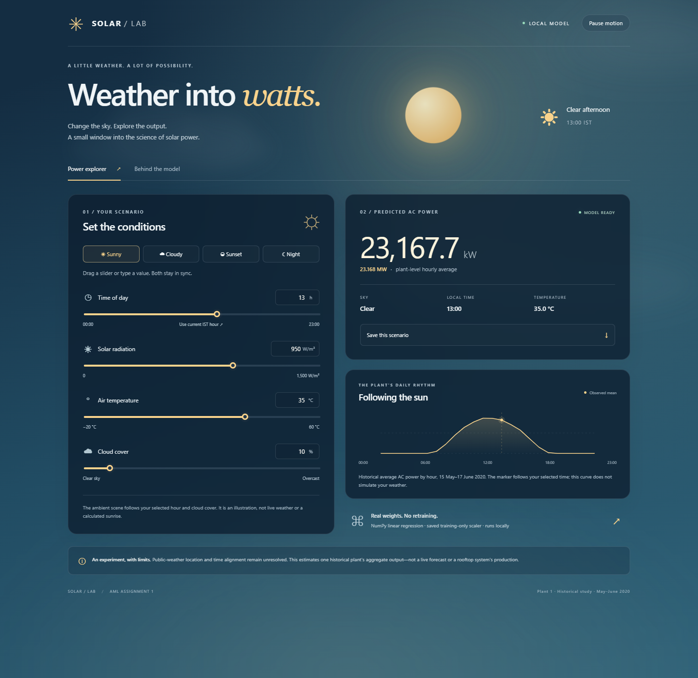

# Solar Lab — AML Assignment 1

A NumPy regression study and interactive webpage for **hourly aggregate AC power at Plant 1**. It compares on-site sensor features (A) with public weather (B). It is a historical scenario explorer, not a validated live forecast or a generic rooftop calculator.

## Open and run

This folder is ready to open with **VS Code → File → Open Folder**. Libraries belong in the project's `.venv`; they are not copied into VS Code or installed into global Python.

Double-click **Run_App.cmd** to open the website directly in your browser. **No Python installation, Setup.cmd or virtual environment is needed just to view the site.** The webpage is custom HTML, CSS and vanilla JavaScript, including the real saved model and all nine figures.

You can also open **app/web/index.html** directly. The bundled model snapshot, animations and plots work offline without a server or external CDN. Keep the entire `app/web/` folder together, including its `plots/` subfolder. Retraining followed by export refreshes both the model snapshot and exact plot copies.

The **Slim** folder/ZIP excludes installed libraries, environments, caches and logs, while retaining all four raw CSVs, source code, trained weights, results, figures and the Word draft. The development environment was hundreds of MB; it is not required for viewing or submitting the project. No source data or results were deleted.

Only if you want to **retrain, run Python tests or use the optional server**:

1. Install Python 3.12 or newer if needed; this project was tested with Python 3.12.14.
2. Double-click **Setup.cmd** while online. It creates a fresh `.venv` and installs the pinned packages.
3. Double-click **Rebuild_Results.cmd** to retrain, or **Run_Server.cmd** for the optional localhost server at http://localhost:8503.

Installing the optional environment will increase this folder's size again. Keep environments out of your submission archive. You can always use Run_App.cmd without installing anything.

Do not move or copy a virtual environment between machines. The ZIP intentionally excludes `.venv`, caches and logs. VS Code's Python extension is recommended in `.vscode/extensions.json`; the interpreter and run/test tasks are configured locally. If VS Code chooses another interpreter, select `.venv/Scripts/python.exe` using **Python: Select Interpreter**.

Equivalent PowerShell commands, from this folder:

```powershell
py -3 -m venv .venv
.\.venv\Scripts\python.exe -m pip install -r requirements.txt
.\.venv\Scripts\python.exe app\html_server.py --port 8503 --open
```

No activation script or system execution-policy change is required. `Setup.cmd` applies a process-only policy for the included setup script. If port 8503 is already occupied, choose another port in the command rather than stopping an unrelated process. The earlier Streamlit version is retained at `app/app.py` and can still be run separately on port 8502.

## Webpage

Predicted power is shown prominently in **kW and MW**. Hour, shortwave radiation, air temperature and cloud cover each have a synchronized slider and typed number input. Sunny, cloudy, sunset and night presets populate every field. Editing a field clears the preset selection. Predictions use the exported **Set B normal-equation** model and training scaler; only negative outputs are clipped. Invalid inputs disable the result rather than leaving a misleading stale prediction.

The sky responds to the selected time and cloud cover: a glowing sun, drifting clouds, warm dawn/sunset colours, or a moon and twinkling stars. These are illustrative ambient scenes, not live weather or astronomical sunrise calculations. The sun moves with the hour, and the scene never overrides numerical predictions. **Pause motion** and the operating system's reduced-motion setting are supported. **Use current IST hour** reads the current clock in Asia/Kolkata, not the computer's timezone.

The **Behind the model** tab shows actual evaluation scores, test-week curves and model details. The main historical daily-profile curve does not simulate selected weather; only its hour marker moves. The interface warns about uncertain location, out-of-training-range inputs and inconsistent night/sunlight scenarios without silently rewriting user input. It provides no invented confidence intervals or accuracy percentages.

The **Plots & diagnostics** tab includes all nine original pipeline PNGs: three-day Open-Meteo vs sensor, actual vs predicted, batch learning rates, SGD learning rates, residuals by hour, and the four required EDA figures. Every image opens at full size and has a PNG download link. Daytime error cards use the corrected saved results, not the older screenshot's numbers. These figures work both on localhost and when the HTML file is opened directly.



Desktop and mobile layouts were checked in real headless Microsoft Edge. `results/html_browser_verification.json` records all four scenes, two-way input synchronization, prediction parity, invalid input, CSV download, animation pause, reduced motion, and direct-file offline operation. Screenshots include `html_cloudy_screenshot.png`, `html_sunset_screenshot.png`, `html_night_screenshot.png`, `html_mobile_screenshot.png`, and `html_evidence_screenshot.png`. Earlier `app_*` images document the retained Streamlit version.

## Reproduce results

Double-click **Rebuild_Results.cmd**, or run:

```powershell
.\.venv\Scripts\python.exe run_pipeline.py
```

This runs preparation, cached weather diagnostics, EDA, training, analysis, then the tests. It overwrites derived hourly data/results, not the four source CSVs. The scripts also work separately in this order:

```powershell
.\.venv\Scripts\python.exe src\prepare.py
.\.venv\Scripts\python.exe src\fetch_weather.py
.\.venv\Scripts\python.exe src\eda.py
.\.venv\Scripts\python.exe src\regression.py
.\.venv\Scripts\python.exe src\train_eval.py
.\.venv\Scripts\python.exe src\analysis.py
.\.venv\Scripts\python.exe -m unittest discover -s tests -p "test_*.py" -v
```

`src/task2.py` is a compatibility entry point for the same four EDA figures. Regression's standalone command runs a synthetic self-test. Model fitting, scaling, cost and RMSE use NumPy only, with no scikit-learn or statistical fitting package.

The weather CSV is included and used **offline by default**. An intentional refresh makes a network request and replaces this derived cache while preserving the returned response and metadata:

```powershell
.\.venv\Scripts\python.exe src\fetch_weather.py --refresh
```

Rebuild after refreshing; historical API revisions may change results. The original downloaded API response was not provided, so the supplied cache's returned grid-cell metadata cannot be retroactively authenticated.

## Dataset and preparation

Source: [Kaggle Solar Power Generation Data](https://www.kaggle.com/datasets/anikannal/solar-power-generation-data). All four raw CSVs are retained, but this study uses Plant 1. Public weather: [Open-Meteo Historical Weather API](https://open-meteo.com/en/docs/historical-weather-api), requested coordinates 14.82 N, 78.28 E, timezone Asia/Kolkata, 15 May–17 June 2020, hourly shortwave_radiation, temperature_2m and cloud_cover.

The 68,778 generation records use `%d-%m-%Y %H:%M`; the 3,182 sensor records use `%Y-%m-%d %H:%M:%S`. Generation is summed across observed inverters at each timestamp. An outer-join audit finds 1 generation-only and 25 sensor-only timestamps. An **inner join at quarter-hour resolution comes before hourly averaging**, so targets and sensor features summarize the same samples.

The hourly CSV preserves all 816 calendar hours, including 20 missing hours. Complete-case modelling uses 796 hours: 628 training rows from 15 May–10 June and 168 test rows from 11–17 June, with no shuffle. Missing values are not imputed or replaced with zero. Coverage diagnostics also report 101 timestamps with fewer than 22 inverters and 14 hours containing only 1–3 matched quarter-hours. These samples are retained and flagged, not artificially scaled up.

Table 1: [Preparation and peak-time checks](results/preparation_table1.md). Detailed timestamp examples, parsed ranges and missing-value counts: `results/preparation_metadata.json`.

## Features and evaluation

Set A: irradiation, module temperature, ambient temperature, sine(hour), cosine(hour).

Set B: public shortwave radiation, temperature at 2 m, cloud cover, sine(hour), cosine(hour).

Means and population standard deviations are fitted on training rows only. The intercept is added after scaling. The cost is **half the sum of squared errors**, so batch updates contain no division by sample count. The normal equation uses the explicit inverse required by the exercise. SGD processes rows in their original chronological order.

All scores below are in kW after clipping negative predictions to zero. The same 97 daylight test observations (measured irradiation > 0) are used for both sets.

| Set | Solver | Alpha | Iterations or epochs | All-hours RMSE | Daytime RMSE |
|---|---|---:|---:|---:|---:|
| A | Normal equation | N/A | Direct | 539.46 | 704.46 |
| A | Batch GD | 0.0001 | 57,846 iterations | 539.46 | 704.46 |
| A | Ordered SGD | 0.01 | 1,000 epochs | 545.69 | 714.02 |
| B | Normal equation | N/A | Direct | 2620.94 | 3409.50 |
| B | Batch GD | 0.0001 | 2,742 iterations | 2620.94 | 3409.50 |
| B | Ordered SGD | 0.01 | 1,000 epochs | 2485.47 | 3148.71 |

Batch rates 0.00001, 0.0001 and 0.001 were tested for 500 iterations; SGD rates 0.0001, 0.001 and 0.01 for 50 epochs, all on Set A training data. The stable rate with the smallest final training cost was selected. The final SGD budget was fixed at 1,000 epochs, not chosen on held-out scores. SGD is not claimed to converge to the exact normal-equation coefficients.

Both batch models actually match normal-equation coefficients rounded to two decimals, with maximum absolute coefficient difference below 0.00001. Per-set iteration counts, scaler statistics, clipping counts, raw predictions and full histories are saved. Full discussion: [Task 5 analysis](results/analysis.md). Tables 2 and 3: `results/table2_model_comparison.csv`, `results/table3_set_a.csv`, `results/table3_set_b.csv`, `results/table3_convergence_checks.csv`.

## Figures and writing

The four required EDA figures and 2–3-sentence observations appear in [EDA observations](results/eda_observations.md). `results/` also includes the three-day location comparison, two learning-rate plots, test-week predictions and residuals by hour.

The editable **Solar_Power_Blog_and_LinkedIn.docx** in `docs/` contains a 1,235-word blog (before sources, including headings/table text), two actual figures, the six-model results table and a separate LinkedIn draft. Copyable Markdown versions are [blog](docs/blog.md) and [LinkedIn](docs/linkedin_draft.md). Word content, images, table rows and template preservation were checked; native page-render verification was unavailable in the build environment, so review page breaks in Word. Links and the partner tag must be filled in before publication.

## Important unresolved items

- **Location and interval alignment:** selected public-minus-sensor peak offsets are 0, +1 and +3 hours. No coordinates or test timestamps were adjusted to improve RMSE. The training-only lag diagnostic favors no shift among those tested, which does not prove correct alignment. Confirm exact plant coordinates and sensor averaging conventions before calling Task 3 fully resolved. See [location investigation](results/location_check.md).
- **Scope:** results concern one aggregate plant over 34 days, not validated roof-scale output, seasonal yield or a future-weather forecast. The raw AC/DC scale is also not a verified efficiency measure.
- **Submission and authorship:** review and understand the implementation and draft, follow your course's AI-use policy, enter actual group-member information and complete genuine contributions from both members. No Git history, second-member work or public URLs have been fabricated.
- **Publication:** no repository, blog, LinkedIn post or public deployment was created automatically. Add the real published links to the drafts and README after you choose to publish.

## Folder map

```text
AML_Assignment_1/
  app/web/      HTML, CSS, JavaScript, model snapshot and plots/ with nine PNGs
  app/          localhost HTML server, pure inference, retained Streamlit version
  data/         four raw CSVs plus hourly data and public-weather cache
  src/          preparation, weather, EDA, NumPy solvers, evaluation, analysis
  results/      required tables, figures, weights, diagnostics, browser evidence
  docs/         editable Word draft plus copyable blog and LinkedIn Markdown
  tests/        data, weather, numerical and Streamlit interaction tests
  .vscode/      interpreter recommendation and run/test tasks
  .streamlit/   local theme and privacy settings
  .venv/        local dependencies only; excluded from ZIP and Git
  Setup.cmd / setup.ps1
  Run_App.cmd   open offline HTML without installing libraries
  Run_Server.cmd  optional Python localhost server
  Rebuild_Results.cmd / run_pipeline.py
  requirements.txt
```

The original project was not overwritten. This is a separate corrected working copy; do not submit the virtual environment or temporary browser logs.
