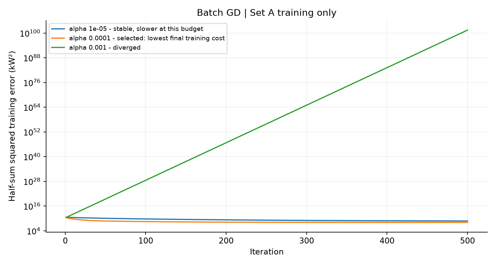
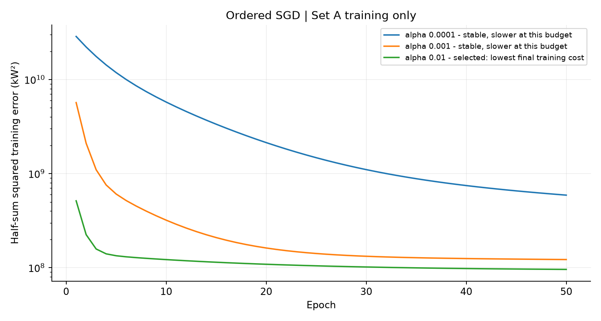
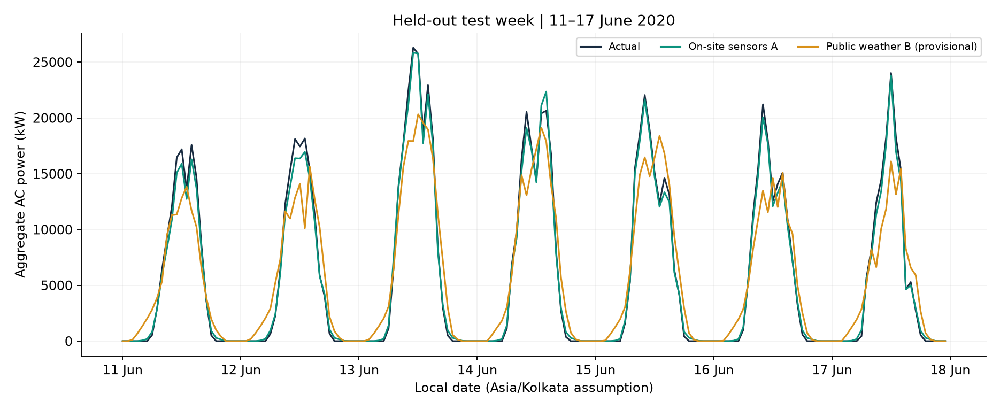
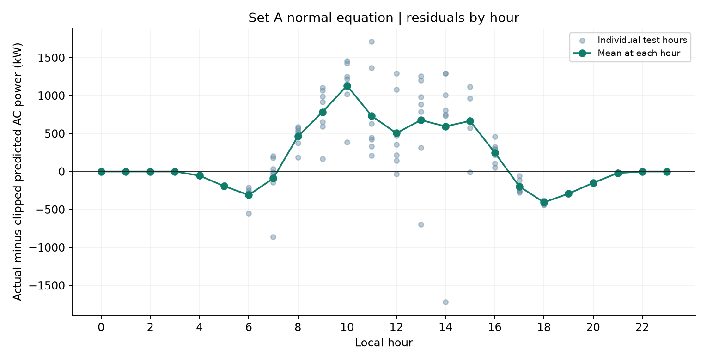

# Analysis of hourly solar power regression

## Question and scope

Can public weather replace on-site measurements for hourly aggregate AC power estimates at Plant 1? The normal-equation models give daytime RMSE of **704.46 kW for on-site sensors** versus **3,409.50 kW for public weather**. This historical observational comparison is not a causal experiment or a validated future forecast. Public-weather location and interval alignment remain unresolved; see [the investigation](location_check.md).

## Data quality

The hourly calendar contains 816 rows. Removing 20 missing hours without interpolation leaves 628 training rows (15 May–10 June) and 168 test rows (11–17 June). The same 97 daytime test rows, defined by on-site irradiation > 0, are used for both sets. Standardization uses training-only means and population standard deviations. The observed training peak is 27,325.90 kW, not a nameplate capacity.

Quarter-hour generation and sensor readings are matched before hourly averaging, so paired features and targets use the same samples. Incomplete inverter coverage and partial hours are reported, not silently repaired. [Table 1](preparation_table1.md) records counts and peak-hour checks. The unusual raw AC/DC ratio must not be interpreted as verified inverter efficiency.

## Table 2 Model comparison

Errors are in kW after clipping negative predictions to zero. For normal equation, alpha, iterations and epochs are not applicable (stored as zero). Learning rates and stopping rules use training data only.

| feature_set | solver | alpha | iterations | epochs | rmse_all_hours | rmse_daytime |
| --- | --- | --- | --- | --- | --- | --- |
| A | normal | 0.000000 | 0 | 0 | 539.464179 | 704.460820 |
| A | batch_gd | 0.000100 | 57846 | 0 | 539.464180 | 704.460821 |
| A | sgd | 0.010000 | 0 | 1000 | 545.687662 | 714.022802 |
| B | normal | 0.000000 | 0 | 0 | 2,620.940503 | 3,409.502837 |
| B | batch_gd | 0.000100 | 2742 | 0 | 2,620.940502 | 3,409.502836 |
| B | sgd | 0.010000 | 0 | 1000 | 2,485.474705 | 3,148.712373 |

## Table 3 Coefficients

All coefficients below use standardized features with an unscaled intercept. Batch GD must match normal-equation coefficients when rounded to two decimals AND have maximum absolute difference at most 0.00001 for each set separately. A difference below 0.005 alone would not guarantee matching rounding.

### Set A

| feature | normal | batch_gd | sgd | abs_diff_batch_vs_normal | abs_diff_sgd_vs_normal |
| --- | --- | --- | --- | --- | --- |
| intercept | 6,890.565960 | 6,890.565960 | 6,882.301315 | 0.000000 | 8.264645 |
| irradiation | 8,345.043877 | 8,345.043869 | 8,256.736179 | 0.000007 | 88.307698 |
| module_temp | -108.120836 | -108.120826 | 14.046726 | 0.000010 | 122.167561 |
| ambient_temp | -17.161873 | -17.161876 | 5.746124 | 0.000003 | 22.907997 |
| sin_hour | -47.376394 | -47.376394 | -53.851807 | 0.000000 | 6.475413 |
| cos_hour | -416.557815 | -416.557815 | -394.776265 | 0.000000 | 21.781549 |

### Set B

| feature | normal | batch_gd | sgd | abs_diff_batch_vs_normal | abs_diff_sgd_vs_normal |
| --- | --- | --- | --- | --- | --- |
| intercept | 6,890.565960 | 6,890.565960 | 7,042.075780 | 0.000000 | 151.509820 |
| sw_radiation | 6,557.735731 | 6,557.735721 | 6,904.781025 | 0.000010 | 347.045294 |
| temp_2m | -207.465543 | -207.465539 | -586.135921 | 0.000004 | 378.670379 |
| cloud_cover | 222.816905 | 222.816905 | 874.129415 | 0.000000 | 651.312510 |
| sin_hour | 374.060941 | 374.060944 | 548.138986 | 0.000002 | 174.078044 |
| cos_hour | -1,899.209178 | -1,899.209186 | -2,477.892621 | 0.000008 | 578.683442 |

| Set | Batch iterations | Batch max coefficient difference | Rounded coefficients agree | SGD epochs | SGD max coefficient difference |
| --- | --- | --- | --- | --- | --- |
| A | 57846 | 0.000010 | True | 1000 | 122.167561 |
| B | 2742 | 0.000010 | True | 1000 | 651.312510 |

## Physical interpretation

The largest absolute non-intercept Set A coefficient is **irradiation**, 8,345.04 kW per training standard deviation, holding other features fixed. A positive irradiation coefficient is consistent with more sunlight producing more power. Weather, temperature and time are correlated; their conditional coefficient signs do not establish a causal thermal efficiency effect. Standardized coefficients allow a scale-aware comparison, unlike a ranking of unscaled raw coefficients.

## Public weather and rooftop suitability

The B-minus-A daytime error gap is **2,705.04 kW**, or **9.90% of training peak**. The respective daytime RMSE values equal 2.58% and 12.48% of peak; these ratios are not prediction accuracies. All-hours RMSE can look better because it includes many easier night hours.

Public weather is useful here as a provisional educational scenario input. One plant, 34 days, uncertain coordinates and imperfect records do not validate a rooftop yield, financial estimate or operational commitment. A roof would need known capacity, orientation, losses, confirmed location, seasonal data and independent validation with future-weather inputs. No transfer or real-time forecast performance is claimed.

## Solvers and scale

Normal equation is direct and needs no learning rate. The exercise uses the explicit inverse of X-transpose-X; a production solution would generally prefer a linear solve or QR/SVD for numerical stability. At alpha 0.0001, batch GD needs **57,846 iterations for A** and **2,742 for B**, measured separately against the stated training-only convergence criterion.

Ordered SGD runs 1,000 epochs at alpha 0.01; it does not shuffle. A fixed step and fixed order leave nonzero coefficient error, so the final model is not claimed to equal the exact least-squares solution. Even if SGD happens to have a smaller held-out RMSE, this does not show that it optimized training least squares better. Its budget and rate were not selected from the test week.

For ten million rows and only six columns, normal-equation sufficient statistics can be accumulated in chunks: a 6-by-6 Gram matrix and a six-element target-product vector. The entire design matrix need not be kept in memory, though forming the Gram matrix still costs work and can worsen conditioning. Batch GD makes many full scans; SGD can stream row updates but needs careful rate and convergence control. When feature counts grow, quadratic Gram-matrix storage and cubic factorization cost favor iterative alternatives. No lecture-specific comparison is invented because the lecture matrix was not supplied.

## Cost curves

The objective is one half of the **sum** of squared training errors, not its mean, so batch updates have no division by sample count. The required batch rates are tested for 500 iterations and SGD rates for 50 epochs. Stable runs compete on their final Set A training cost; final model budgets are separate.

| solver | alpha | budget | initial_cost | final_cost | stable | selected | assessment |
| --- | --- | --- | --- | --- | --- | --- | --- |
| batch_gd | 0.000010 | 500 | 38,164,354,064.750908 | 588,777,442.308854 | True | False | stable, slower at this budget |
| batch_gd | 0.000100 | 500 | 38,164,354,064.750908 | 121,943,628.682695 | True | True | selected: lowest final training cost |
| batch_gd | 0.001000 | 500 | 38,164,354,064.750908 | 293,263,408,049,222,095,726,024,232,702,858,691,279,857,737,306,500,026,920,255,361,807,374,405,444,877,351,827,362,026,847,117,246,464.000000 | False | False | diverged |
| sgd | 0.000100 | 50 | 38,164,354,064.750908 | 590,814,652.687240 | True | False | stable, slower at this budget |
| sgd | 0.001000 | 50 | 38,164,354,064.750908 | 122,144,480.255131 | True | False | stable, slower at this budget |
| sgd | 0.010000 | 50 | 38,164,354,064.750908 | 95,970,051.928843 | True | True | selected: lowest final training cost |

Batch curves record full cost after each simultaneous update. SGD curves record full-dataset cost once at the end of each epoch, hiding within-epoch row fluctuations; a smooth curve does not imply an averaged objective or smooth individual updates. Rates reported as divergent are excluded, while stability over a finite experiment is not a universal guarantee.

## Residuals and test week

Residuals are actual minus clipped prediction: positive means underprediction, negative means overprediction. The largest hourly mean occurs at 10:00 (1,131.67 kW), and the smallest at 18:00 (-404.94 kW). Each hour has just seven test observations, so hour-specific patterns are descriptive, not a validated seasonal correction. The test residuals were not used to tune a correction.

## Frontend and remaining work

The webpage loads saved Set B normal-equation weights and the training scaler. Hour enters as sine/cosine; weather inputs are radiation, temperature and cloud cover. Only negative output is clipped. A positive night prediction is a model limitation, not silently replaced with zero. The interface is an aggregate-plant historical scenario explorer.

Confirm plant coordinates and sensor averaging semantics before treating the location-check requirement as resolved. Review and understand the code and writing, and add genuine contributions and public repository/blog links for both group members. No external publication or fabricated commit history is included.
