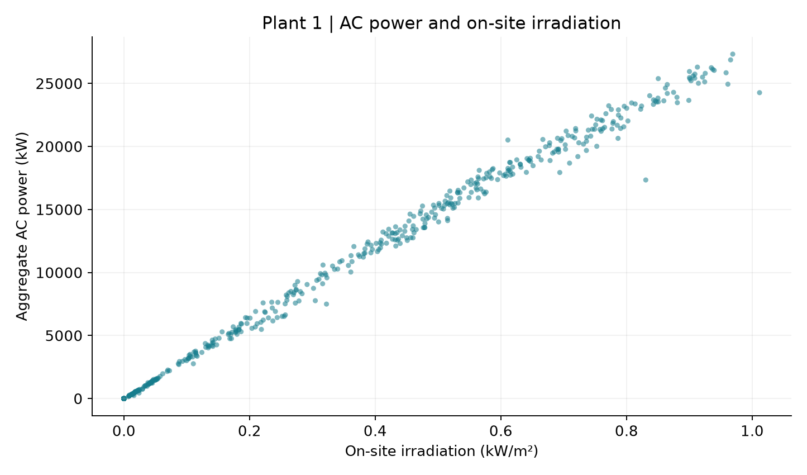
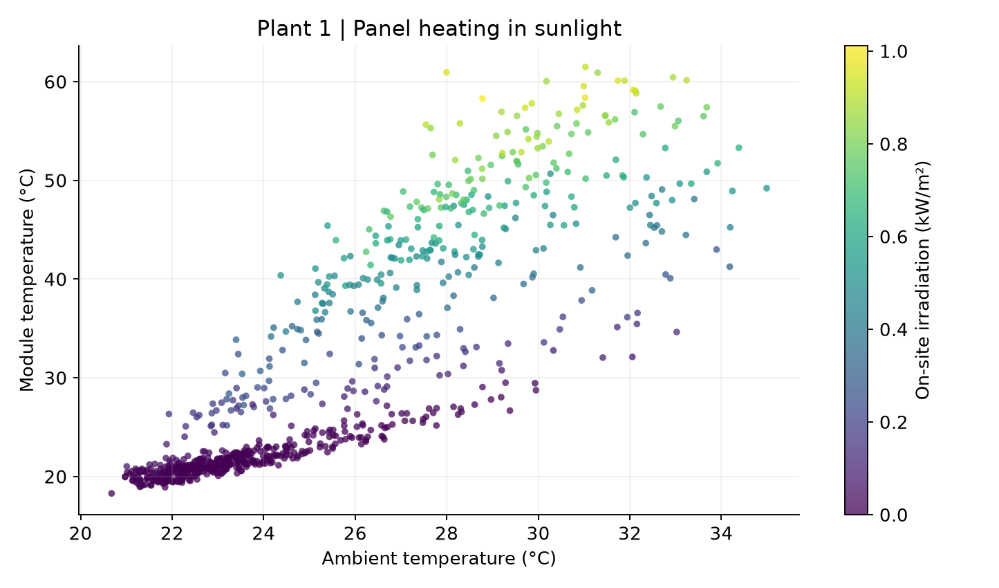
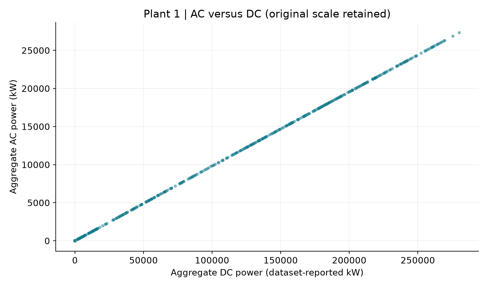
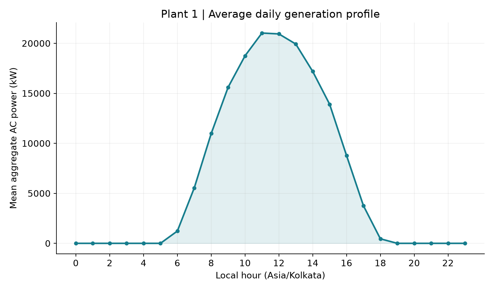

# Task 2 — Exploratory observations

These figures describe 796 complete hourly observations from 15 May–17 June 2020; 20 missing hours are not filled with zero. Exploratory summaries cover the full period, but scaling, learning-rate selection and fitting use training dates only.

## 1. AC power versus irradiation

The hourly AC-power/irradiation correlation is 0.998, with power generally rising as on-site sunlight increases. The scatter around that relation shows that irradiation alone is not a perfect description of output; temperature, inverter availability and changing conditions may contribute, but this plot cannot separate their effects.

## 2. Module versus ambient temperature

Module and ambient temperatures are positively associated (correlation 0.857), while brighter points tend to show hotter modules. During hours with positive irradiation, the median module-minus-ambient temperature is 11.30 °C; heating under sunlight is consistent with that pattern rather than evidence of causation from ambient temperature alone.

## 3. AC versus DC power

AC and DC power are closely associated (correlation 1.00000), but the median AC/DC ratio over positive-DC hours is only 0.0978. This unusual raw scale means the ratio must not be presented as a verified inverter conversion efficiency; the original values are retained and their units/scaling require source clarification before a physical efficiency claim.

## 4. Average AC power by hour

The mean daily profile peaks at local hour 11:00 at 21,028.3 kW. The curve rises during daylight and falls towards the night, supporting cyclic hour features, but a 34-day mean hides individual cloudy-day variation and is not an annual energy estimate.

